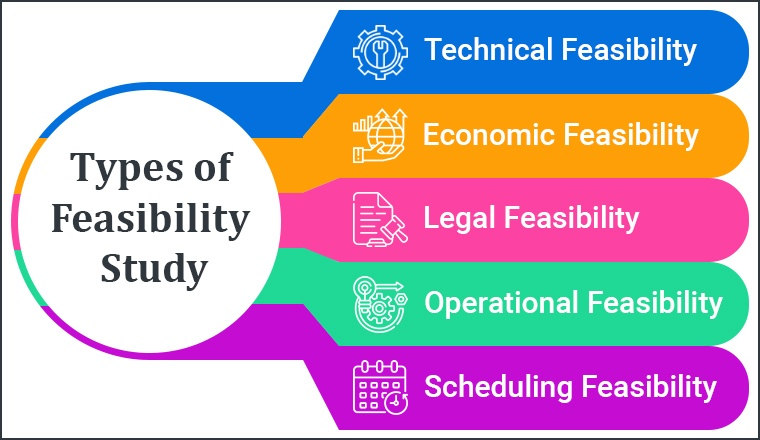

# Feasibility study requirement analysis

In Software Architecture Design (SAD), a `feasibility` study and requirement analysis are crucial initial steps that help ensure the success of a software project. 

Here’s an overview of both components:

**Feasible = Doable**

> It describes a preliminary study undertaken to determine and document a project's `viability`. The results of this analysis are used in making the decision whether to proceed with the project or not.

A feasibility study and requirement analysis are crucial initial steps that help ensure the success of a software project. 