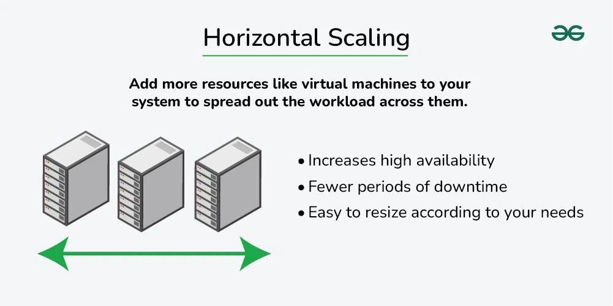

# Horizontal and Vertical Scaling

## What is Scalabilty?

Scalability refers to the ability of a system to handle increasing amounts of workload or requests without sacrificing performance or incurring excessive costs.

There are two main types of scalability:

**1. Vertical scaling or `Scale-up`**

**2. Horizontal scaling or `Scale-out`**

`Horizontal scaling` and `vertical scaling` are two different approaches to scaling a system, both of which can be used to improve the performance and capacity of the system.
